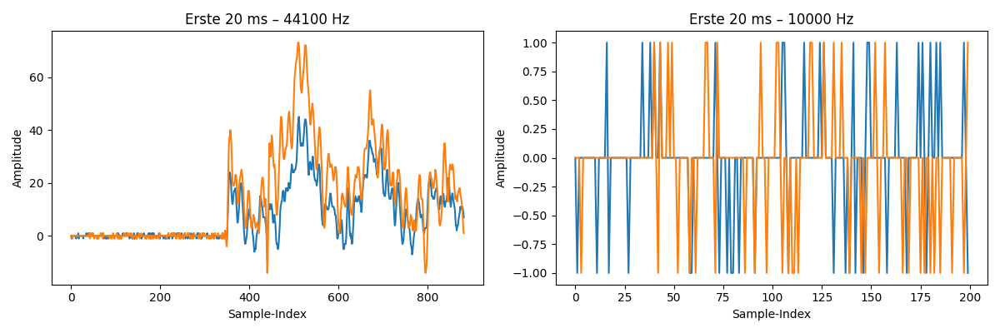
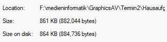

Trung Dam - 24444446
# Übungsaufgabe 2

## Aufgabe: Audiosignale einslesen, bearbeiten, anzeigen

### Rechnung

**Formel:**

$$\text{Größe (Bytes)} = \text{Dauer} \times \text{Samplerate} \times \text{Kanäle} \times \frac{\text{Bittiefe}}{8}$$

**Werte der Aufnahme:**
- Dauer: 5 s
- Samplerate: 44.100 Hz
- Kanäle: 2 (Stereo)
- Bittiefe: 16 Bit

$$5 \times 44100 \times 2 \times \frac{16}{8} = 882.000 \text{ Bytes} \approx 861 \text{ KB} \approx 0{,}84 \text{ MB}$$

### Reflexion

**Was ist im Plot sichtbar?**
Im Plot der ersten 20 ms sind die Amplitudenwerte des aufgenommenen Sprachsignals als Wellenform dargestellt. In Bereichen ohne Sprache liegt die Amplitude nahe null (Stille), während bei Sprache deutliche Ausschläge in positive und negative Richtung sichtbar sind. Da die Aufnahme stereo ist, zeigt der Plot beide Kanäle überlagert.

**Welche Rolle spielt die Samplerate?**
Die Samplerate bestimmt, wie viele Abtastwerte pro Sekunde gespeichert werden und damit den darstellbaren Frequenzbereich (Nyquist-Theorem: max. Frequenz = Samplerate / 2). Bei 44.100 Hz können Frequenzen bis 22.050 Hz erfasst werden, was dem menschlichen Hörbereich entspricht. Eine niedrigere Samplerate wie 10.000 Hz begrenzt den Frequenzbereich auf 5.000 Hz, wodurch Höhen verloren gehen und die Aufnahme dumpfer klingt.

**Stimmt die Rechnung?**

Die berechneten 882.000 Bytes stimmen mit der tatsächlichen Dateigröße von `aufnahme.wav` nahezu überein — die geringe Abweichung entspricht dem 44-Byte-WAV-Header. Die Formel ist damit korrekt.
