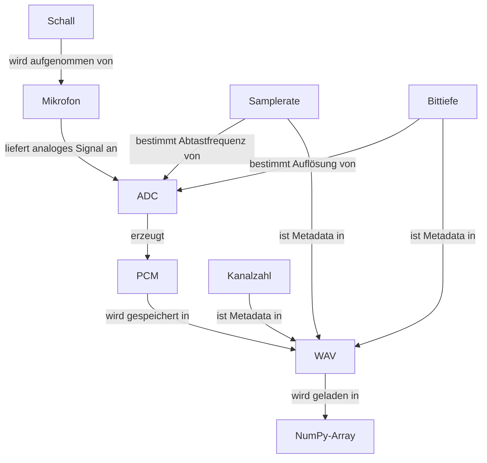

Trung Dam - 24444446
# Übungsaufgabe 1

## Aufgabe: Concept Map zum Audio-Signalweg

### a. Definitionen

| Begriff | Definition |
|---|---|
| **Schall** | Mechanische Schwingungen, die sich durch ein elastisches Medium (z.B. Luft) ausbreiten und vom Ohr als Ton oder Geräusch wahrgenommen werden. |
| **Mikrofon** | Wandler, der akustische Schallwellen in ein elektrisches analoges Signal umwandelt. |
| **ADC** | Analog-Digital-Wandler, der ein analoges Signal in eine Folge diskreter digitaler Werte umwandelt. Wird durch Samplerate und Bittiefe konfiguriert. |
| **Samplerate** | Anzahl der Abtastwerte pro Sekunde (z.B. 44.100 Hz). Bestimmt den Frequenzbereich. |
| **Bittiefe** | Anzahl der Bits pro Abtastwert (z.B. 16 Bit). Bestimmt den Dynamikumfang und die Amplitudenauflösung der Aufnahme. |
| **PCM** | Pulse Code Modulation – Verfahren zur digitalen Kodierung analoger Signale durch gleichmäßige Abtastung und Quantisierung als Binärwerte. |
| **WAV** | Dateiformat für unkomprimiertes digitales Audio, das PCM-Daten zusammen mit Metadaten (Samplerate, Bittiefe, Kanalzahl) speichert. |
| **Kanalzahl** | Anzahl unabhängiger Audiokanäle einer Aufnahme (1 = Mono, 2 = Stereo). Beeinflusst Dateistruktur und Array-Dimensionen. |
| **NumPy-Array** | Mehrdimensionale Datenstruktur in Python, die PCM-Audiodaten nach dem Einlesen einer WAV-Datei als numerische Werte hält und effiziente Signalverarbeitung ermöglicht. |

---

### b. Verbindungen (Pfeile)

---

### c. Zuordnung

| Kategorie | Begriffe |
|---|---|
| **Reale Welt / Hardware** | Schall, Mikrofon, ADC |
| **Digitale Repräsentation in Python** | PCM, WAV, NumPy-Array |