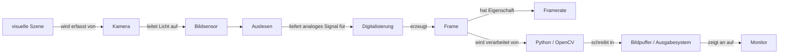

# Übungsaufgabe 3

## Aufgabe: Concept Map zum von Szene bis zur Darstellung auf dem Monitor

### a. Definitionen

| Begriff | Definition |
|---|---|
| **visuelle Szene** | optisches Signal aus reale Welt |
| **Kamera** | Gerät, um ein Bild aufzunehmen |
| **Bildsensor** | lichtempfindliche Pixelmatrix |
| **Auslesen** | Überführen Sensorsignale in elektrische Signalfolge |
| **Digitalisierung** | Umwandlung analogen optisches Signale in diskrete Zahlenwerte |
| **Frame** | erstelltes Einzelbild nach der Digitalisierung |
| **Framerate** | beschreibt wie viel Bilder pro Sekunden des Videos |
| **Python / OpenCV** | bearbeitet digitalisierten Fotos und Videos (als Folge digitaler Frame)  |
| **Bildpuffer / Ausgabesystem** | speichert bearbeitete Frames temporär |
| **Monitor** | Ausgabegerät zur Darstellung der Bilddaten auf dem Bildschirm |

---

### b. Verbindungen (Pfeile)

### Verwendete LLMs
- Verwendetes Tool: Claude Opus 4.6
- Wofür es genutzt wurde: Erstellung von Concept Map und Tabelle (syntaxtisch)
- Was selbst fachlich geprüft oder überarbeitet wurde: Inhalt des Maps und Tabelle anhand der Vorlesungsfolien bearbeiten